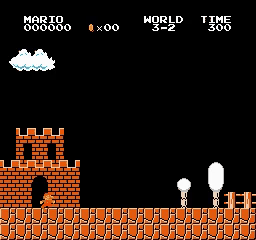
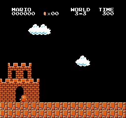
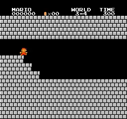
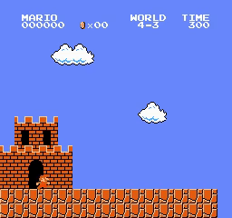
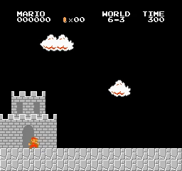
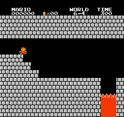

# Mario_PPO
Playing Super Mario Bros with Recurrent Proximal Policy Optimization (LSTM PPO)

## Introduction

My PyTorch Recurrent Proximal Policy Optimization (LSTM PPO) implement to playing Super Mario Bros (This is [PPO paper](https://arxiv.org/abs/1707.06347)). This paper doesn't use LSTM, I implement LSTM PPO base on normal PPO (without LSTM), A2C LSTM (idea of using LSTM) and this tutorial [ppo-implementation-details](https://iclr-blog-track.github.io/2022/03/25/ppo-implementation-details/)

  
  
  
   
  
  
  
   
  
  
  
   
  
  
  
   
  
  
  
   
  
  
  
   
  
  
  
   
  
  
  
   
  <i>Results</i>

## Motivation

My PPO implementation [PPO](https://github.com/CVHvn/Mario_PPO) just completed 31/32 stages of Mario Bros. I want to improve PPO algorithms to complete all stages. I completed all stages by combining PPO with Random Network Distillation [PPO_RND](https://github.com/CVHvn/Mario_PPO_RND) but these algorithms have some limits and I want to use other methods to complete all stages. Limit of PPO_RND:
- Random Network Distillation is the key to completing the hardest stages (8-4). I want to learn how to improve PPO algorithms, not random network distillation.
- Using Random Network Distillation takes more GPU memory and takes a longer time to complete.

I think that LSTM can improve A2C in most cases, so I think it can help PPO. Implementing PPO with LSTM will make my coding skills better because it has a lot of side problems compared with normal PPO.

## How to use it

You can use my notebook for training and testing agent very easy:
* **Train your model** by running all cell before session test
* **Test your trained model** by running all cell except agent.train(), just pass your model path to agent.load_model(model_path)

Or you can use **train.py** and **test.py** if you don't want to use notebook:
* **Train your model** by running **train.py**: For example training for stage 1-4: python train.py --world 1 --stage 4 --num_envs 8
* **Test your trained model** by running **test.py**: For example testing for stage 1-4: python test.py --world 1 --stage 4 --pretrained_model best_model.pth --num_envs 2

## Trained models

You can find trained model in folder [trained_model](trained_model)

## Hyperparameters

I create hyperparameters same as normal PPO. 

| World | Stage | num_envs | learn_step | batchsize | epoch | lambda | gamma | learning_rate | target_kl | clip_param | max_grad_norm | norm_adv | V_coef | entropy_coef | loss_type | training_step | training_time | lstm penalty |
|-------|-------|----------|------------|-----------|-------|--------|-------|---------------|-----------|------------|---------------|----------|--------|--------------|-----------|---------------|---------------|---------------|
| 1 | 1 | 8 | 256 | 64 | 10 | 0.95 | 0.99 | 7e-5 | 0.05 | 0.2 | 0.05 | TRUE | 0.5 | 0.01 | huber | 359422 | 11:31:29 | 0 |
| 1 | 2 | 16 | 512 | 64 | 10 | 0.95 | 0.9 | 7e-5 | 0.05 | 0.2 | 0.5 | FALSE | 0.5 | 0.01 | huber | 408060 | 9:32:45 | 0 |
| 1 | 3 |  |  |  |  |  |  |  |  |  |  |  |  |  |  |  |  |  |
| 1 | 4 | 8 | 256 | 64 | 10 | 0.95 | 0.99 | 7e-5 | 0.05 | 0.2 | 0.05 | TRUE | 0.5 | 0.01 | huber | 20476 | 0:51:16 | 0 |
| 2 | 1 | 16 | 512 | 64 | 10 | 0.95 | 0.9 | 7e-5 | 0.05 | 0.2 | 0.5 | FALSE | 0.5 | 0.01 | huber | 687612 | 14:42:22 | 0 |
| 2 | 2 | 16 | 512 | 64 | 10 | 0.95 | 0.9 | 7e-5 | 0.05 | 0.2 | 0.5 | FALSE | 0.5 | 0.01 | huber | 384981 | 9:23:04 | 0 |
| 2 | 3 | 16 | 512 | 64 | 10 | 0.95 | 0.9 | 7e-5 | 0.05 | 0.2 | 0.5 | FALSE | 0.5 | 0.01 | huber | 161772 | 4:28:11 | 0 |
| 2 | 4 | 16 | 512 | 64 | 10 | 0.95 | 0.9 | 7e-5 | 0.05 | 0.2 | 0.5 | FALSE | 0.5 | 0.01 | huber | 59372 | 1:54:13 | 0 |
| 3 | 1 | 16 | 512 | 64 | 10 | 0.95 | 0.9 | 7e-5 | 0.05 | 0.2 | 0.5 | FALSE | 0.5 | 0.01 | huber | 139775 | 3:32:33 | 0 |
| 3 | 2 | 16 | 512 | 64 | 10 | 0.95 | 0.9 | 7e-5 | 0.05 | 0.2 | 0.5 | FALSE | 0.5 | 0.01 | huber | 89581 | 2:42:18 | 0 |
| 3 | 3 | 16 | 512 | 64 | 10 | 0.95 | 0.9 | 7e-5 | 0.05 | 0.2 | 0.5 | FALSE | 0.5 | 0.01 | huber | 46592 | 1:29:40 | 0 |
| 3 | 4 | 16 | 512 | 64 | 10 | 0.95 | 0.9 | 7e-5 | 0.05 | 0.2 | 0.5 | FALSE | 0.5 | 0.01 | huber | 98301 | 2:28:50 | 0 |
| 4 | 1 | 16 | 512 | 64 | 10 | 0.95 | 0.9 | 7e-5 | 0.05 | 0.2 | 0.5 | FALSE | 0.5 | 0.01 | huber | 103923 | 3:04:39 | 0 |
| 4 | 2 | 16 | 512 | 64 | 10 | 0.95 | 0.9 | 7e-5 | 0.05 | 0.2 | 0.5 | FALSE | 0.5 | 0.01 | huber | 610773 | 13:27:25 | 0 |
| 4 | 3 | 16 | 512 | 64 | 10 | 0.95 | 0.99 | 7e-5 | 0.05 | 0.2 | 0.5 | FALSE | 0.5 | 0.01 | huber | 244732 | 7:16:08 | 0.01 |
| 4 | 4 |  |  |  |  |  |  |  |  |  |  |  |  |  |  |  |  |  |
| 5 | 1 | 16 | 512 | 64 | 10 | 0.95 | 0.9 | 7e-5 | 0.05 | 0.2 | 0.5 | FALSE | 0.5 | 0.01 | huber | 316414 | 7:27:11 | 0 |
| 5 | 2 | 16 | 512 | 64 | 10 | 0.95 | 0.9 | 7e-5 | 0.05 | 0.2 | 0.5 | FALSE | 0.5 | 0.01 | huber | 400383 | 10:13:49 | 0 |
| 5 | 3 |  |  |  |  |  |  |  |  |  |  |  |  |  |  |  |  |  |
| 5 | 4 | 16 | 512 | 64 | 10 | 0.95 | 0.99 | 7e-5 | 0.05 | 0.2 | 0.5 | FALSE | 0.5 | 0.01 | huber | 494080 | 12:06:38 | 0 |
| 6 | 1 | 16 | 512 | 64 | 10 | 0.95 | 0.9 | 7e-5 | 0.05 | 0.2 | 0.5 | FALSE | 0.5 | 0.01 | huber | 67562 | 2:08:42 | 0 |
| 6 | 2 | 16 | 512 | 64 | 10 | 0.95 | 0.9 | 7e-5 | 0.05 | 0.2 | 0.5 | FALSE | 0.5 | 0.01 | huber | 900601 | 20:45:18 | 0 |
| 6 | 3 | 16 | 512 | 64 | 10 | 0.95 | 0.99 | 7e-5 | 0.05 | 0.2 | 0.5 | FALSE | 0.5 | 0.01 | huber | 911865 | 20:30:31 | 0 |
| 6 | 4 | 16 | 512 | 64 | 10 | 0.95 | 0.9 | 7e-5 | 0.05 | 0.2 | 0.5 | FALSE | 0.5 | 0.01 | huber | 78845 | 2:03:56 | 0 |
| 7 | 1 | 16 | 512 | 64 | 10 | 0.95 | 0.9 | 7e-5 | 0.05 | 0.2 | 0.5 | FALSE | 0.5 | 0.01 | huber | 432634 | 11:03:01 | 0 |
| 7 | 2 | 16 | 512 | 64 | 10 | 0.95 | 0.9 | 7e-5 | 0.05 | 0.2 | 0.5 | FALSE | 0.5 | 0.01 | huber | 450044 | 9:44:04 | 0 |
| 7 | 3 | 16 | 512 | 64 | 10 | 0.95 | 0.9 | 7e-5 | 0.05 | 0.2 | 0.5 | FALSE | 0.5 | 0.01 | huber | 315902 | 8:28:46 | 0 |
| 7 | 4 | 16 | 512 | 64 | 10 | 0.95 | 0.99 | 7e-5 | 0.05 | 0.2 | 0.5 | FALSE | 0.5 | 0.01 | huber | 172032 | 4:39:51 | 0 |
| 8 | 1 | 16 | 512 | 64 | 10 | 0.95 | 0.9 | 7e-5 | 0.05 | 0.2 | 0.5 | FALSE | 0.5 | 0.01 | huber | 2047992 | 1 day, 15:19:33 | 0 |
| 8 | 2 | 16 | 512 | 64 | 10 | 0.95 | 0.9 | 7e-5 | 0.05 | 0.2 | 0.5 | FALSE | 0.5 | 0.01 | huber | 1168880 | 1 day, 0:16:16 | 0 |
| 8 | 3 | 16 | 512 | 64 | 10 | 0.95 | 0.9 | 7e-5 | 0.05 | 0.2 | 0.5 | FALSE | 0.5 | 0.01 | huber | 1526775 | 1 day, 6:29:45 | 0 |
| 8 | 4 |  |  |  |  |  |  |  |  |  |  |  |  |  |  |  |  |  |

## Questions

* Is this code guaranteed to complete the stages if you try training?
  
  - This hyperparameter does not guarantee you will complete the stage. But I am sure that you can win with this hyperparameter except you have a unlucky day (need 2-3 times to win because of randomness)

* How long do you train agents?
  
  - Within a few hours to more than 1 day. Time depends on hardware, I use many different hardware so time will not be accurate.

* How can you improve this code?
  
  - You can separate the test agent part into a separate thread or process. I'm not good at multi-threaded programming so I don't do this.

* Compare with PPO?

- Maybe I implemented wrong way, but PPO LSTM will be worse than Normal PPO all:
  - only completed easy stages 28/32 (Normal PPO can completed 31/32)
  - take a longer time to convert.
  - harder to implement
  - I tried some other approaches, but I couldn't complete more stages, maybe it needs more modification or more hyperparameter tuning, so I stop improve LSTM PPO and found other methods to improve PPO:
      - Only use lstm hidden like input, not modify algorithms as my A2C implements. Just save (h, c) with state and reuse it. Shuffle data like normal LSTM, only reset (h, c) when the environment reaches the terminal state.
      - Using longer batch-size, so step per env each batch-size will longer, I can enable gradient through time with LSTM (my implement stop gradient of LSTM, just update by one step).

## Requirements

* **python 3>3.6**
* **gym==0.25.2**
* **gym-super-mario-bros==7.4.0**
* **imageio**
* **imageio-ffmpeg**
* **cv2**
* **pytorch** 
* **numpy**

## Acknowledgements
With my code, I can completed 28/32 stages of Super Mario Bros. LSTM PPO even worse than Normal PPO. I will try other methods to improve PPO later.

## Reference
* [CVHvn A2C](https://github.com/CVHvn/Mario_A2C)
* [Stable-baseline3 ppo](https://stable-baselines3.readthedocs.io/en/master/_modules/stable_baselines3/ppo/ppo.html#PPO)
* [uvipen PPO](https://github.com/uvipen/Super-mario-bros-PPO-pytorch)
* [lazyprogrammer A2C](https://github.com/lazyprogrammer/machine_learning_examples/tree/master/rl3/a2c)
* [ppo-implementation-details](https://iclr-blog-track.github.io/2022/03/25/ppo-implementation-details/)
